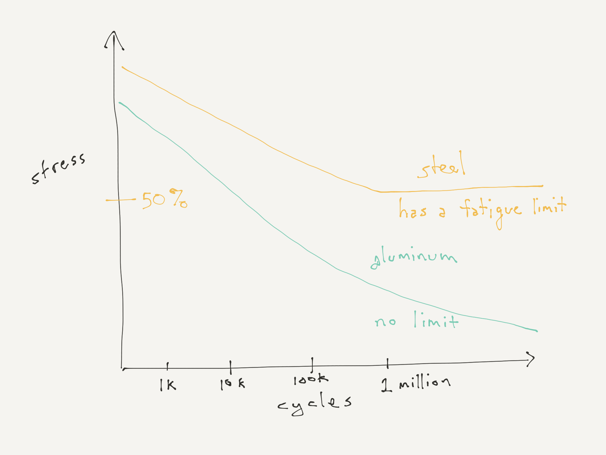

# Axes of comparison #

## Stiffness ##

## Toughness ##

## Cost ##

## Fabrication methods ##

## Fatigue ##

## Creep ##

## Moisture resistance ##

## Temperature resistance

    1. Plastics
        A. Hard plastics
            1. ABS
            2. Acetal resin (Delrin)
            3. Acrylic (Plexiglas)
            4. Nylon
            5. PLA
            6. Polycarbonate (Lexan, AKA bullet-proof glass)
            7. Polyethylene (high density and low density)
            8. Polyimide (Kapton)
            9. Polypropylene
            10. PTFE (Teflon)
        B. Rubber
            1. Silicone
        C. Foam
    2. Metal
        A. Aluminum
        B. Steel and stainless steel
        C. Cast iron
        D. Soft metals: Copper, brass, bronze
        E. Weird metals and alloys: titanium, tungsten, lead, tin, nickel, chrome, Inconel, zinc
    3. Wood
        A. Construction lumber
        B. Hardwood
        C. Plywood
    4. Glass and ceramics
    5. Composites
        A. Fiberglass
        B. Carbon fiber
        C. Aramid fiber (Kevlar)
    6. Fabrics
